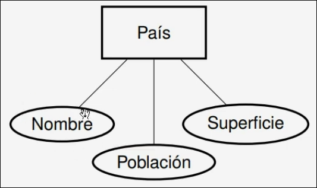
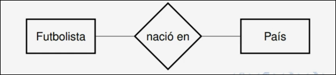
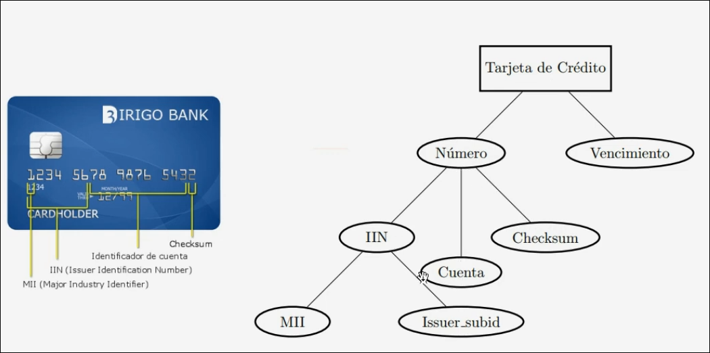
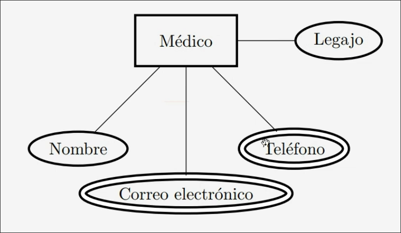
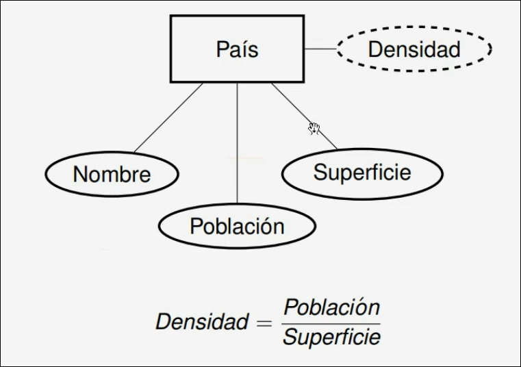
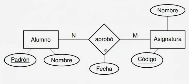
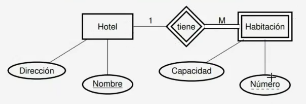

# Diseño Conceptual

Un modelo de datos debe incluir los siguientes elementos:

- Un conjunto de **objetos**, sus propiedades e **interrelaciones** entre ellos, que reprensenta la **estructura**.

- Un conjunto de **operaciones**, o lenguaje, que permite manipular los datos.

- **Restricciones** sobre los objeots, las interrelaciones y las operaciones.

# Modelo Entidad-Interrelacion

> Modelo esquemático basado en **entidades**, **interrelaciones** y **atributos** para el modelado semántico de datos.

- **Tipo de entidad:** Es un tipo o clase de objeto en particular. Ejemplo: Persona, Animal, País, etc.

>[!NOTE]
> Una **entidad** es una **instancia** de un **tipo de entidad**. Ejemplo: Argentina (País)

- **Atributo:** Es una propiedad que describe a la entidad. Ejemplo: País $\rightarrow$ Población.

- **Tipos de interrelación:** Es la definición de un conjunto de relaciones o asociaciones similares entre dos o mas tipos de entidades. Ejemplo: Persona nació en Paìs.

>[!NOTE]
> Una **interrelación** en concreto es: Messi nació en Argentina.

## Diagrama Entidad-Interrelacion

- Las entidades con sus atributos se diagraman de la siguiente manera: 

Mientras que las interrelaciones se diagraman: 

## Atributos

- Cada entidad tendrá **valores** particulares para cada uno de los atributos del tipo de dentidad al que corresponde.

>[!NOTE]
> Ejemplo: País(nombre, población, superficie)
> (Argentina, 40.117.096, 2.780.400 $\text{km}^2$)

- El **dominio** de un atributo es el conjunto de valores que el mismo puede tomar.

>[!NOTE]
> El atributo **nombre** es una cadena de caracteres (string).
> El atributo **población** es un número entero positivo.
> El atributo **superficie** es un número real positivo.

- En ciertos casos un atributo no tome ningun valor concreto, en estos casos el atributo toma **valor nulo** o **NULL**.

>[!NOTE]
> En estos casos se puede dar por alguno de estos motivos:
> 1. La entidad aún no posee ese atributo.
> 2. El valor de ese atributo para es entidad se desconoce.

### Atributos compuestos y simples

> Existen atributos que se **componen** de otros.

### Atributos multivaluados y monovaluados.

> Un atributo es **multivaluado** cuando puede tener 2 o más valores para una misma entidad.

### Atributos almacenados y derivados.

> Un atributo es **derivado** cuando se puede calcular a partir de otros atributos.

## Entidades

- **Conjunto de entidades:** Al conjunto de ocurrencias o instancias de un determinado tipo de entidad en un estado determinado de la base de datos se lo denomina **conjunto de entidades** de ese tipo de entidad.

### Restricción de unicidad

- Todo tipo de entidad debe tener un subconjunto del conjunto de atributos cuyos valores sean necesariamente distintos para cada una de las entidades en el conjunto de entidades.$\rightarrow$ Al menos uno de los atributos me debe permitir poder indentificar la entidad.

- Dichos atributos se llaman **atributos clave** o **identificadores únicos**.

- Si no los encontramos, debemos crear uno $\rightarrow$ **id**.

- Al ser distintos para cada entidad, los atributos clave permiten identificar unívocamente a las entidades.

>[!TIP]
> Dentro del diagrama Entidad-Interrelacion se los representa subrayados.

>[!WARNING]
> El conjunto de atributos clave debe ser **minimal**, aún así, es posible que exista más de un conjunto de atributos clave para un tipo de entidad.
> Para elegir un **atributo clave** se debe tener en cuenta la semántica de los datos (que representan) y no el estado actual de la BDD, por ejmeplo, podría tener una BDD donde no existen personas con mismo nombre, pero esto no significa que el atributo nombre sea un buen atributo clave.

## Interrelaciones

### Aridad

- La **aridad** o **grado** de un tipo de interrelación es la cnatidad de tipos de entidad que coparticipan del mismo.

### Restricciones de cardinalidad

- La **cardinalidad** es la máxima cantidad de instancias de cada tipo de entidad que pueden relacionarse con una instancia concreta de los tipos de entidades restantes.

### Restricciones de participación

- La **participación** es la mínima cantidad de instancias de cad tipo de entidad que deben relacionarse con una intancia concreta de los tipos de entidades restantes.

- Cuando requerimos que cada instancia participe de alguna otra instancia para poder subsistir, diremos que esta tendrá **participación total** o **dependencia existencial**. En caso contrario diremos que tiene **participación parcial**.

- En los diagramas se utiliza **min** y **max** que denotan **participación** y **cardinalidad** respectivamente.

>[!NOTE]
> Las interrelaciones también pueden tener atributos.

### Interrelaciones

- Las interrelaciones tambien pueden tener atributos.

> [!NOTE]
> Se le pone `aprobó` y no `cursó` porqué sirve para distinguir entre distintos vinculos.

- Solo pueden formar parte de los atributos clave de una interrealación los atributos clave de los tipos de entidad que participan de la misma.

> [!NOTE]
> En general la elección de los atributos clave está fuertenemente condicionada por la cardinalidad.

## Modelo ER Avanzado

### Entidades fuertes y débiles

A veces la identificación de una entidad depende de su interrelación con otra entidad.

- Cuando un tipo de entidad depende de otro para ser identificado, se dice que es un **tipo de entidad débil**

- La clave de una entidad débil se compone de la clave de su entidad identificadora, se llaman **discriminantes**.

> [!NOTE]
> Una entidad debil tiene participación total.

### Interrelaciones n-arias.

- Son aquellas en que participan 2 o más tipos de entidad distintos.

