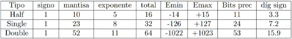
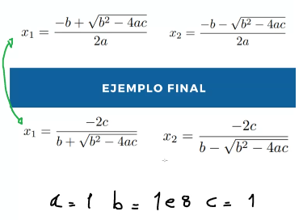

# Practica 1.

## Introducción.

- Los `Métodos Numéricos` proveen soluciones aproximadas.
- Entonces, tienen `Errores`.

### Errores.

- Relativo / Absoluto.
- Grosero / Accidental / Sistemático.
- Redondeo $\rightarrow$ Problemas de almacenamiento. Por lo general con 3 dígitos alcanza.
- Inherentes $\rightarrow$ Mediciones físicas.
- Truncamiento $\rightarrow$ Saco decimales. Tambien se lo suele llamar discretizar.

> [!NOTE]
> Suponiendo $Y = \sum_{i = 1}^{\inf} (\frac{1}{2})^i$ en algún momento cortamos la iteración ya que cada vez la suma es menor.

- En métodos númericos lo que se hace es en vez de utilizar límite es *sacarlo*y realizar varias iteraciones que eventualmente se interrumpen.

### Ejemplo con busqueda de raices.

- Elijo 2 puntos tal que sus imágenes tengan distinto signo y si la función es monótona y continua me aseguro que en ese intervalo hay una raiz.

- Sumo ambos puntos y divido por 2 $\rightarrow$ DyC

- Evaluo ese punto y achico el intervalo dependiendo del valor.

- Eventualmente los dígitos van a diferir muy poco, en ese momento corto la iteración. Esto tendrá un error, ya que en algún momento estaremos truncando dígitos y redondeando otros.

> [!NOTE]
> Basicamente buscar raices utilizando un algoritmo por DyC (Busqueda Binaria). Con complejidad $\mathcal{O}(\log n)$

## Representación de Punto Flotante.

### Números de máquina

$$M: \{ (-1)^{\text{s}} \cdot c \cdot 2^q\}$$

- S es el bit de signo, vale 0 o 1.
- C es la mantisa, el valor que queremos representar.
- q es el exponente. que va de $-1023$ a $1024$.

> [!NOTE]
> Esta forma no permite representar el 0, pero las representaciones son mas densas cerca del 0, y cuanto mas lejos del 0 se esté menos representaciones habrán.

> [!IMPORTANT]
> Realizar el siguiente ejercicio para la próxima clase. Utilizar los valores y las fórmulas equivalentes y ver si los resultados son iguales.

