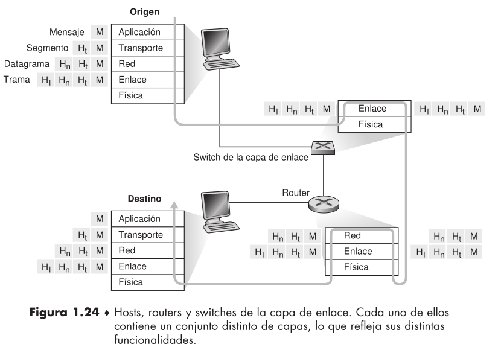

# Capas de protocolos y sus modelos de servicio

## Arquitectura en capas

> Una arquitectura de capas nos permite estudiar una parte específica y bien definida de un sistema
más grande y complejo. Esta simplificación tiene un valor considerable por sí misma, al proporcionar
modularidad, haciendo mucho más fácil modificar la implementación del servicio suministrado por
la capa.

### Capas de protocolos

> Para proporcionar una estructura al diseño de protocolos de red, los diseñadores de redes organizan los protocolos (y el hardware y el software de red que implementan los proto-
colos) en capas.

- Cuando los protocolos de las distintas capas se toman en conjunto se denominan pila de protocolos.

#### Capa de aplicación.

- Donde residen las aplicaciones de red y sus protocolos de nivel de aplicación. Ejemplo HTTP.

- Es muy fácil crear e implantar protocolos nuevos en la capa de aplicación $\rightarrow$ DNS (Domain Name System)

- Un protocolo de la capa de aplicación está distribuido entre varios sistemas terminales, con la aplicación en un sistema terminal utilizando el protocolo para intercambiar paquetes de información con la aplicación que se ejecuta en otro sistema terminal. A este paquete de información de la capa de aplicación lo denominaremos mensaje.

#### Capa de transporte

- Transporta los mensajes de la capa de aplicación entre los puntos terminales de la aplicación. Ejemplo TCP.

- Incluye el suministro garantizado de los mensajes de la capa de aplicación al destino.

- Denominaremos a los paquetes de la capa de transporte segmentos.

#### Capa de red

- Responsable de trasladar los paquetes de la capa de red, conocidos como **datagramas** de un host a otro.

- La capa de red de internet incluye el protocolo IP, que define los campos del datagrama.

- Contiene protocolos de enrutamiento.

#### Capa de enlace

- Para trasladar un paquete (completo) de un nodo al siguiente nodo de la ruta se utilizan los servicios de la capa de enlace.

- Los paquetes de la capa de enlace se denominan **tramas**.

- Los servicios de la capa de enlace dependen del protocolo concreto de la capa de enlace que se emplee para dicho enlace.

#### Capa física

- El trabajo de la capa física consiste en mover de un nodo al siguiente los **bits individuales** que forman la trama.

- Son dependientes del enlace ya que dependen de su medio de transmisión.

#### El modelo OSI

- Lo mencionado anteriormente es el detalle de la pila de protocolos de Internet, pero no es la única existente.

- Esta estandarizado que las redes de computadoras fueran organizadas utilizando 7 capas, lo cual se denomina el modelo OSI.

## Encapsulación

- Los dispositivos no implementan todas las capas de la pila de protocolos.

