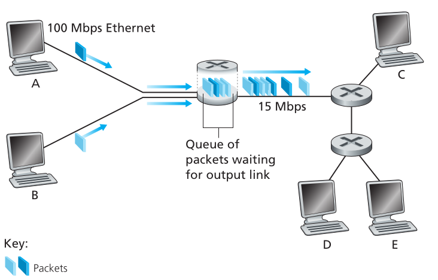
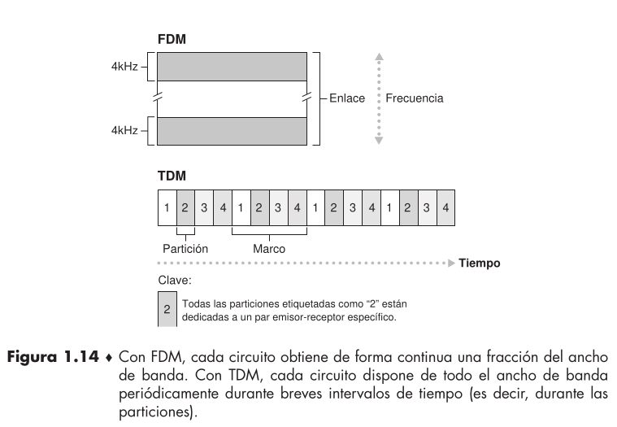

# The Network Core

## Packet Switching (Multiplexación de paquetes)

- En una aplicación de red los end systems intercambian **mensajes** entre sí. 

- Para enviar un mensaje de un lugar a otro, la fuente transforma mensajes grandes en partes mas pequeñas llamadas **paquetes**.

- El paquete viaja entre links de comunicación y "packet switches" $\rightarrow$ Para esto hay 2 tipos predominantes, **routers** y **link-layer switches**.

- Los paquetes son transmitidos al ratio igual al total del ratio de transmisión del link.

> [!NOTE]
> Si un source end system o un packet switch envia un paquete de L bits por un link que tiene una transmición de R bit/sec, entonces el tiempo de transmisión del paquete es de $\frac{L}{R} \text{ s}$.

### Store and Forward Transmission.

- La mayoría de packet switches usan una transmisión **store and forward**.

- Esto significa que el packet switch debe recibir el paquete entero antes de empezar a transmitir el primer bit del paquete a otro link.

#### Ejemplo sencillo de delay con 1 solo paquete

> Si mandamos L bits a un ratio de R bits por segundo, la fuente empieza a transmitir en el segundo 0 y al segundo $\frac{L}{R}$ termina de enviar el paquete. Como el router ya recibió todo el paquete puede empezar a enviarlo y al segundo $2 \cdot \frac{L}{R}$ el paquete llega a destino. El delay total es de $2 \cdot \frac{L}{R}$. En caso de que apenas llega el primer bit al router se empieza a enviar el paquete, el delay total sería de $\frac{L}{R}$ (Esto último no sería Store and Forward)

#### Ejemplo sencillo de delay con 3 paquetes

> Al igual que antes, sabemos que el tiempo en el que se empieza a transmitir el primer paquete es el segundo 0 y llega completo al router en el segundo $\frac{L}{R}$ y empezará a enviar el segundo paquete, ahora, como el primer paquete esta completo este se empieza a enviar a destino y llegará en un tiempo $2 \cdot \frac{L}{R}$ y, a su vez, el segundo paquete llegará a destino en $3 \cdot \frac{L}{R}$. Finalmente todos los paquetes llegaran en un tiempo total de $4 \cdot \frac{L}{R}$.

Entonces, para el caso general de N links podemos decir qué:

$$d_{\text{end to end}} = N \cdot \frac{L}{R}$$

### Queuing Delays and Packet Loss

- Cada paquet switch tiene multiples links y por cada uno tiene un **output buffer** o **output queue**, el cual almacena paquetes que el router esta por re-enviar a un link.

- En caso de que ese link este ocupado debe esperar en el output buffer $\rightarrow$ **queuing delays**.

- Como el tamaño del buffer es limitado, si el paquete encuentra que el buffer esta completo ocurrirá **packet loss**, lo cual significa que o bien el mimso paquete que llego o uno que ya estaba esperando en la fila será descartado.

### Forwarding Tables and Routing Protocols.

- Muchas maneras de hacer forwarding y elegir el link para hacer forward a un paquete.

- Todo end system tiene una dirección IP y cuando un source system quiee enviar un paquete a un destino, la fuente incluye la dirección IP en el header del paquete. 

- Una vez llegado al router, examina la dirección destino y lo re-envia a un router adyacente. Cada router tiene una **forwarding table** que mapea direcciones destino con el link de salida del router.

- Existen **routing protocols** que son usados para automaticamente crear **forwarding tables**.

### Conmutación de Circuitos.

- 2 metodos fundamentales para transportar datos a traves de una red de enlaces y coinmutadores $\rightarrow$ **conmutación de circuitos** y **conmutación de paquetes**.

| Conmutación de Circuitos|Conmutación de Paquetes|
| ------------- |----------|
| Los recursos necesarios a traves de la ruta (buffers, velocidad de tranmissión del link, etc) que permiten establecer comunicación entre los end system están reservados durante el tiempo que dura la sesión| Estos recursos no están reservados, los mensajes de una sesión utilizan los recursos bajo petición y pueden tener que esperar para poder acceder a un link de comunicación|

#### Multiplexación en redes de conmutación de circuitos

- Los circuitos de enlace se implementan mediante **multiplexación por división de frecuencia (FDM)** o mediante **multiplexación por división de tiempo (TDM)**.

- La conmutación de paquetes es mas eficiente en ciertos casos, ya que al ser por demanda no se desperdician recursos.

## Una red de redes

> El acceso a internet se logra a través de conectarse por un ISP, a su vez, los distintos ISP deben conectarse entre sí $\rightarrow$ red de redes.

#### Estructura de red 1.

- Interconecta a todos los ISP de acceso mediante un **único ISP global de tránsito**.

- ISP global $\rightarrow$ red de routers y enlaces de comunicaciones. Muy costoso.

#### Estructura de red 2.

- Miles de ISP de acceso y multiples ISP globales de transito.

- La empresas compiten por el servicio.

- Jerarquía en 2 niveles donde los proveedores globales de tránsito residen en el nivel superior y los ISP de acceso en el inferior.

#### Estructura de red 3

- No solo hay multiples ISP competidores de nivel 1, sino que tambien puede haber múltiples ISP regionales compitiendo. Ejemplo: China tiene ISP de acceso en cada ciudad, que se conectan a ISP provinciales, y estos se conectan a ISP nacionales, finalmente estos se conectan a ISP de nivel 1.

#### Estructura de red 4

- Es similar a la Internet de hoy en día. Tiene **puntos de presencia** (PoP), **multidomiciliación** (multihoming), **conexiones entre pares** (peering) y puntos de intercambio Internet (IXP, Internet Exchange Point).

- **PoP:** Grupo de uno o más routers de la red del proveedor, a través de los cuales los ISP clientes pueden conectarse al ISP proveedor.

- **Multidomiciliación:** Conectarse a 2 o más ISP proveedores.

- **Peering:** Como los ISP clientes pagan a un ISP proveer para el acceso de interconectividad a internet, 2 ISP proximos situados en un mismo nivel de jerarquía pueden conectar directamente sus redes, de modo que el tráfico que se intercambien pase por la conexión directa, en lugar de a través de intermediarios logrando reducir costos.

- **Punto de Intercambio de Internet:** Punto de reunión en el que múltiples ISP pueden establecer conexiones entre pares. Punto de reunión en el que múltiples ISP pueden establecer conexiones entre pares. 

#### Estructura de red 5

- La internet de hoy en día.

- Se construye sobre la red anterior, agregande **redes de proveedores de contenido**. Ejemplo: Google.
