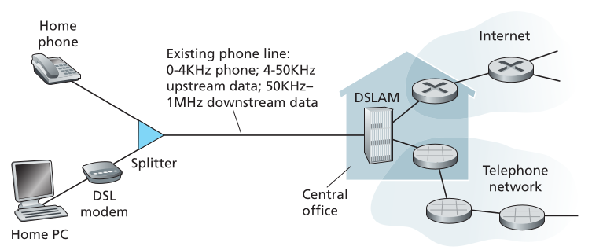
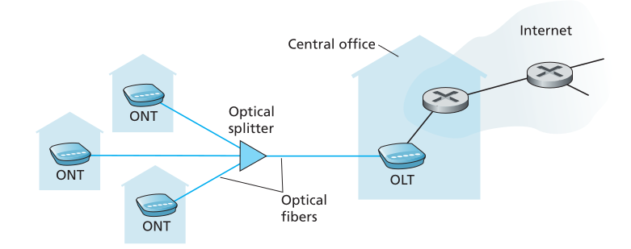
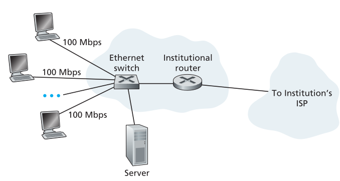

# La frontera de la red.

- Los hosts se pueden dividir en 2 categorias $\rightarrow$ cliente y servidor. Donde el cliente suele ser una PC, un smartphone, etc y el server tiende a ser una maquina mas potente que almacena y distribuye paginas web, servicios de streaming de video, entre otros.

## Redes de acceso (Access Networks)

> La red que se conecta fisicamente a un end system con el primer router (edge router) a un camino entre el end system y cualquier otro end system.

- En la actualidad los tipos de acceso residencial de banda ancha mas frecuentes son la Linea de Abonado Digital (Digital Subscriber Line o DSL) y cable.

### DSL

- Una residencia en general obtiene acceso a internet DSL a través de la misma compañía de telefonía local que provee su propio servicio cableado de telefono.

- Cada modem DSL usa una linea existente de telefono para intercambiar data con un **Digital Subscriber Line Access Multiplexer (DSLAM)** localizado en la oficina central de la compañía.

- Esto se logra cambiando con las frecuencias en la que se transmiten los paquetes, utilizando un único link.

### Internet por cable.

- Por otro lado, el **acceso a internet por cable** hace uso de la infraestructura cableada de la compañia de televisión.

- Como en este sistema se utilizan cables de fibra y coaxiales (fiber and coaxial cables) suele ser referida como Hybrid Fiber Coax network (HFC).

- Este tipo de acceso a internet requiere de modems especiales (cable modems).

- Se suele conectar a una PC via Ethernet. Tiene dos canales uno de subida y otro de bajada.

- Algo particular de este tipo de red es que el medio de transmisión es compartido. Cada paquete enviado desde una casa viaja en el canal de subida hasta el final, y viceversa, es por esta razon que si muchos usuarios estan descargando videos a la vez el ratio de descarga sea menor.

### FTTH

Si bien estas alternativas son las mas usadas, existe una nueva tecnología que provee velocidades de internet mas altas: **Fiber To The Home (FTTH)**.

- El concepto es simple, proveer un camino de fibra optica desde la oficina central hasta la casa.

- En general una misma fibra es compartida entre varias casas, pero, una vez "cerca" se dividen para cada una. Hay 2 arquitecturas que compiten para hacer esta división: **Active Optical Networks (AOP)** y **Passive Optica Networks (PON)**.

#### Arquitectura PON

En la imagén se puede ver la arquitectura PON, cada casa tiene un **Optical Network Terminator (ONT)** que esta conectado por fibra optica dedicada a un splitter dentro de la zona residencial.

El Splitter combina un cierto numero de casas en una sola, compartiendo la fibra optica, la cual se coencta a una Optical Line Terminator (OLT) que se encuentra en la oficina central de la empresa.

#### Acceso en la empresa (y en el hogar): Ethernet y WiFi.

En muchas lugares se usa una red LAN (Local Area Network) para concetar un end system con un edge router. Hay muchas teconologías LAN, sin embargo, la mas usada es Ethernet.

Otro tipo de red LAN es la wireless LAN, conocido como **WiFi**.

#### Acceso Wireless en areas extensas: 3G y LTE.

A diferencia del WiFi el usuario necesita estar a unos pocos kilometros de la estación base.

## El medio físico.

- Cuando un bit pasa por varios routers y links, pasando así por varios pares transmisor-receptor. Por cada par, el bit propaga ondas electromagneticas o pulsos opticos a traves de  un **medio físico**.

El medio físico tiene 2 categorias: **guided media** y **unguided media**.

| Guided Media|Unguided Media|
| -------------------|--------|
| Las ondas son guiadas a través del medio solido, como el cable de fibra optica o cable coaxial| Las ondas se propagan en la atmosfera y el espacio, como en Wireless LAN (WiFi) o un canal digital satelital |

> [!NOTE]
> El costo de un link físico (cable de cobre, cable de fibra optica, etc) suele ser menor comparado con otros costos de redes.

### Twisted-Pair Copper Wire.

- El medio mas barato y utilizado de transmisión guiada.

> [!HINT]
> Un ejemplo fácil de recordar es el teléfono de cable.

- 2 conductores de cobre en paralelo.

- Se usa también para internet residencial.

### Coaxial Cable.

- 2 conductores de cobre concentricos

- Utilizado en sistemas de cableado de televisión.

- Puede ser utilizado como un **medio guiado compartido**.

### Fiber Optics.

- La fibra óptica es un medio flexible y fino que conduce pulsos de luz, donde cada pulso representa un bit.

- Son inmunes a la interferencia electromagnetica.

### Terrestrial Radio Channels.

- Los canales de radio llevan señales en el espectro electromagnetico.

- NO requiren cable físico para ser instalados, pueden atravesar paredes y proveer conectividad a los usuarios mobile.

- Dependen del medio de propagación, lo cual puede aumentar y/o disminuir la fuerza de la señal.

Los canales de radio terrestres se pueden clasificar en 3:

1. Aquellos que operan en distancias cortas $\rightarrow$ 1 o 2 metros.

2. Aquellos que operan en areas locales $\rightarrow$ generalmente entre decenas y uno pocos cientos de metros.

3. Aquellos que operan en un gran area $\rightarrow$ generalmente entre decenas de kilometros.
