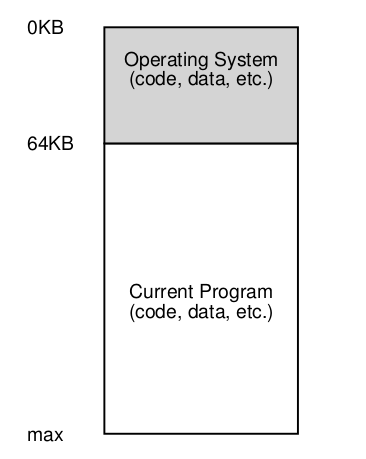

# The Abstraction: Address Spaces

- Empieza a surgir la noción de **interactividad** $\rightarrow$ **multiprogramación**.

En la imágen se puede ver como en un principio, el SO y los programas que se ejecutan en él, comparten la misma memoria. Esto implica que los programas pueden sobreescribirse entre sí, lo que es un problema. Para solucionar esto, se introduce la idea de **espacios de direcciones**.

- La idea de **time sharing** se vuelve más popular, lo que a su vez trajo nuevos problemas. Se necesitaba una forma de **proteger** los programas de los otros programas y del SO.

## Address Space

> Abstracción **fácil de usar** de la memoria física.

- El address space de un proceso contiene todo el estado de memoria del programa corriendo. Esto puede ser el **código, los datos, el stack, el heap**, etc.

- Dentro del address space se enceuntran las **direcciones virtuales**, las cuales junto con soporte del **hardware** el SO puede traducir a direcciones físicas.

### Objetivos

- **Protección**: Un proceso no puede acceder a la memoria de otro proceso.
- **Multiprogramación**: Varios procesos pueden estar corriendo al mismo tiempo.
- **Transparencia**: Un proceso no necesita saber que comparte memoria con otros procesos.

