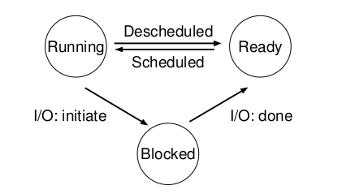

# The Abstraction: The Process

- El OS provee una abstracción la cual es fundamental para su funcionamiento, el **proceso**.

> Def informal: El programa que esta corriendo.

- Hoy en día, una computadora suele correr multiples procesos a la vez (browser, editor de texto, etc).

El SO lo que hace es crear la ilución de que cada proceso tiene su propia CPU mediante la virtualización. Corre un proceso, luego lo frena para correr otro, y así sucesivamente. 

> Esto se conoce como **time sharing**.

- Para poder realizar esto se necesita `maquinaria` tanto de bajo nivel como ed alto nivel, estas son:
   1. **Context Switch**: Le da al OS la habilidad de para un proceso que esta corriendo para correr otro en una misma CPU.
   2. **Scheduling Policy**: Política para decidir que proceso debería correr.

## Process API

El OS provee una API para manejar procesos

- **Create:** Crear un proceso, ya sea mediante el **shell** o doble click en un ícono.

- **Destroy:** Terminar un proceso, ya sea mediante el **shell** o cerrando una ventana.

- **Wait:** Esperar a que un proceso termine.

- **Miscellaneous Control:** Pausar, continuar, etc.

- **Status:** Obtener información sobre un proceso.

### Cración de procesos

- Para crear un proceso lo que debe hacer el SO es **cargar** su código en memoria, en el **address space** del proceso. Los programas se guardan en disco en algún tipo de formato ejecutable.

- Luego se debe alocar memoria tanto para el **stack** y el **heap** del proceso.

- En los sistemas Unix like en particular, todos los procesos son creados con 3 file descriptors abiertos $\rightarrow$ **stdin, stdout, stderr**.

### Estado de un proceso

Suelen haber más estados, pero los 3 principales son:

- **Running:** El proceso esta corriendo en algún CPU actualmente.
- **Ready:** El proceso esta listo para correr, pero no esta corriendo.
- **Blocked:** El proceso esta esperando por algo, como una lectura de disco.

> El estado de un proceso puede cambiar, esto significa que puede ser **scheduled** o **descheduled**.
