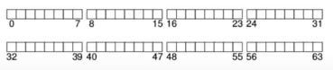
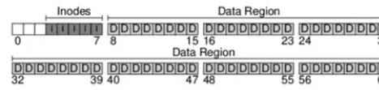
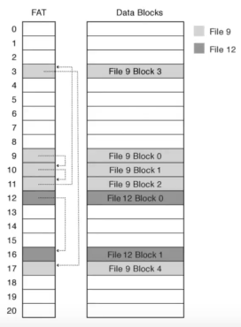

# File System II 

## Requisitos de diseño

EL objetivo principal del diseño de un filesystem es poder construir la abstracción de `archivo` sobre un medio de almacenamiento basado en bloques.

- __**Escritura de índice:**__ Forma de localizar cada bloque del archivo. Las estructuras de pindice suelen er algún tipo de árbol para lograr escalabilidad y soportarla localidad

- __**Mapa de espacio libre:**__ Proporciona una forma de asignar bloques libres para expandir un archivo.

### Organización general

- Lo primero que se debe hacer es dividir al disco en bloques, los sistemas de archivos simples, suelen tener bloques de un solo tamaño (ej 4 KB).

- La visión del file system debe ser una partición de N bloques (0 a N-1) de un tamaño N $\times$ 4KB.

- A la hora de armar un file system una de las cosas que es necesaio almacenar son los datos. La mayor cantidad del espacio ocupado en un file system es por los datos de usuario $\rightarrow$ `data region`

- Tambien debe mantener información sobre cada uno de estos archivos $\rightarrow$ metadata. Esta información mantiene qué bloque de datos pertenece a un determinado archivo, el tamaño del archivo, etc. Los sistemas `unix like` utilizan una estructura llamada `inodo`.

- Otra estructura importante es el `bit map` que mantiene información sobre qué bloques están libres y cuáles no. 

- Un `bit map` se puede pensar como un array de 8 bits, donde cada bit representa si un bloque esta ocupado o libre, es decir, el primer bit indica si el primer bloque esta libre o no y así sucesivamente.

### Casos de estudio FAT Y FFS

#### FAT

Microsoft File Allocation Table fue el sistema de archivos de MS-DOS y las versiones mas tempranas de windows.

- Cada archivo en el sistema corresponde a una lista enlazada de entradas en la FAT, en la que cada entrada contiene un puntero a la siguiente.

- La FAT contiene una entrada por cada bloque de la unidad de disco o volúmen.

> Esto es solo la tabla de entradas, no el FS entero.

#### FFS

Fast File System de Unix ilustra ideas importantes tanto para indexar la información de un archivo de bloques  para que puedan ubicarse rapidamente y para colocar datos en el disco para obtener una buena ubicación.

- Utiliza una estructura de tipo árbol para localizar cualquier bloque en un archivo y que es eficiente tanto para grandes como para pequeños archivos.

#### Buffer Cache

Como los discos son muy lentos hay que guardar los bloques leidos en memoria principal. El `buffer cache` tiene 2 funciones:

1. Sincronizar el acceso a los bloques de disco para asegurar que solo haya una copa de un bloque en la memoria y que solo un hilo del kernel use esa copia a la vez.

2. Almacenar en caché los bloques populares para que no sea necesario volver a leerlos desde el disco.

> Cuando se hace un `write`, para minimizar las escrituras a disco se guarda primero en el `buffer cache` y luego se escribe en disco haciendo un `flush`.

> Si por algún motivo falla la escritura (quedan partes sin sincronizar) primero se escribe el registro en log (lo cuál es más barato), luego se escribe en el bloque en sí. Si hubo fallas, se recupera todo del log y se ejecutan las escrituras de nuevo.

- Utiliza un modelo de **transacciones** donde una transacción es un conjunto de operaciones en el disco que deben ejecutarse en conjunto, sino no pueden ser realizadas. Se utiliza `begin_op()` y `end_op()`, una vez ejecutada `end_op` y obteniendo un resultado positivo, se puede garantizar que eventualmente la información estará persistente en el disco.
