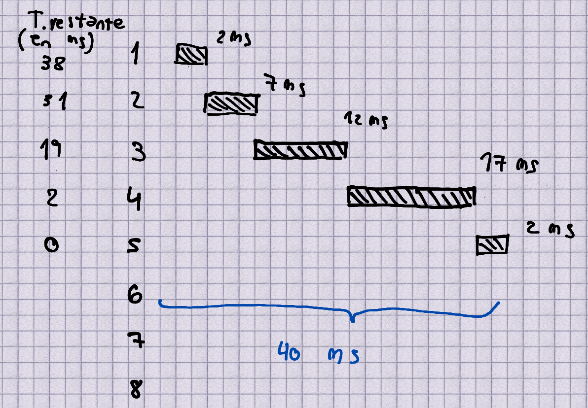

# Memoria virtual

## ¿Que es la memoria virtual?
- La memoria virtual es la abstracción que provee el SO sobre la memoria física. Esta abstracción permite la multiprogramación, es decor, que el SO puede tener en memoria más programas que la cantidad de memoria física disponible.

Para esto, el SO cumple un rol de `ilusionista` en el cual *hace creer* a los procesos que tienen toda la memoría física disponible para usar, cuando en realidad no es así.

Para poder realizar esta abstracción el SO debe proveer:

1. **Transparencia:** Los procesos no deben notar que es lo que está ocurriendo y no deben cambiar nada de su implementación debido a esto.

2. **Eficiencia:** El SO debe ser capaz de realizar esta abstracción de forma eficiente, es decir, que no debe ser costoso en términos de tiempo y recursos.

3. **Protección:** El SO debe ser capaz de proteger a los procesos de otros procesos y del mismo SO. Es decir, que un proceso no pueda acceder a la memoria de otro proceso.

## ¿Que mecanismos conoce, describa los 3 que le parezcan mas relevantes?

### Base and Bounds

- **Base and Bounds** es un mecánismo en el cual se divide a la memoria utilizando dos registros de procesador, el registro `base` y el registro `bound`. 

- El registro `base` indica la dirección de inicio de la memoria del proceso y el registro `bound` indica el tope de la memoria del proceso. De esta forma, cuando un proceso intenta acceder a una dirección de memoria, el SO verifica que la dirección de memoria esté dentro del rango de memoria del proceso, y de no hacerlo lanza un error.

- Si bien esta forma no es muy eficiente, es sencilla de implementar.

### Segmentación

- La idea de segmentación es muy similar a **Base and Bounds**. En particular se puede notar que un proceso puede estar compuesto de un stack, un heap y un código (los datos que lo componen). Por lo que se puede dividir la memoria en segmentos, cada uno correspondiente a una parte del proceso. 

- Es decir, el procesador debe proveer 3 pares de registros de tipo base and bounds para poder implementar segmentación, donde cada par contiene el rango válido de direcciones de memoria para el stack, el heap y el código/texto.

- Para saber que segmento se debe usar, se toma los primeros 2 bits para indicar el segmento y los demás como un offset.

- Hoy en día se sigue utilizando, aunque cada vez menos. El problema que tiene la `segmentación` es la **fragmentación externa** ya que pueden quedar espacios contiguos libres que no sean lo suficientemente grandes como para asignarlos a un segmento. Si bien hay formas de resolver este problema (**compactación**) esta operación es muy costosa.

### Memoria paginada de nivel 1

- En este macanismo se divide la memoria en bloques de tamaño fijo (suelen ser de 4kb). Para este mecánismo se le debe indicar a la **Memory Management Unit**(MMU) donde se encuentra la **Page Table** donde se encuentra la información para traducir las direcciones virtuales en físicas.

- La traducción consta de tomar los 20 bits más altos (teniendo direcciones de 32 bits y págines de 4kb) para indicar la página, luego los 12 restantes son el offset dentro de la misma.

- Si bien este mecanismo resuelve los problemas anteriores de fragmentación de la memoria, por otro lado trae un nuevo problema. Al tener que guardar la Page Table, esta constará de un arreglo de $2^{20}$ entradas por proceso, lo cual es muy costoso.

> [!NOTE]
> La MMU es un componente del procesador que se encarga de traducir las direcciones virtuales a direcciones físicas.

## Explicar el mecanismo de address translation **memoria virtual paginada** de tres niveles de indirección de 32 bits. Indique la cantidad de direcciones de memoria que provee la virtual address de la imágen con tablas de registros de 4 bytes.

El esquema de **memoria virtual paginada de tres niveles** es el siguiente:

Los primeros 20 bits indican las tablas mientras que los últimos 12 el desplazamiento dentro de la página.

- La cantidad de direcciones de memoria que provee es de $2^{32}$ ya que en el primer y segundo nivel se tendrán $2^{7}$ entradas, y en el tercero $2^{6}$

# Scheduling

## ¿Que es un **context switch**? En un context switch cuales de las siguientes cosas deben/no deben ser guardadas y y porqué: 

1. Registros de proposito general
2. Translation lookaside buffer (TLB)
3. Program counter
4. Page Directory Entry (PDE)
5. Process Control Block Entry (PCB)

- Un **context switch** es el mecanismo que realiza un SO cuando decide dejar de correr un proceso para correr otro. Para ello, el SO debe guardar el estado del proceso actual y cargar el estado del proceso siguiente. Dentro de la lista mencionada, se deben guardar:

1. Registros de proposito general ya que son los registros que estaba utilizando el proceso antes de realizar el cambio de contexto, por lo que para volver al estado anterior necesariemente necesita guardarlos y recuperarlos.

2. No es necesario ya que es interno del MMU, por lo que no es necesario guardarlo en un context switch.

3. El program counter es neceesario guardarlo ya que indica la proxima instrucción a ejecutar, por lo que, de no guardarlo, la ejecución que estaba llevando a cabo el proceso se rompería.

4. El PDE es necesario guardarlo ya que cada proceso tiene su propio address space y la información traducida se encuentra ahí.

5. Guardar el PCB es necesario, ya que de no hacerlo se perdería toda la información anterior.

> [!NOTE]
> Un **context switch** tambien se da dentro del pasaje de `modo usuario` a `modo kernel` (y viceversa) dentro de un SO. Este se da cuando desde el espacio de usuario se necesita acceder a kernel land (por ejemplo para ejecutar una **syscall**), para ello, se cede el control al kernel y luego se vuelve al espacio de usuario recuperando toda la información antes del cambio.

## Explique la política de scheduling **MLFQ** detalladamente. Sea 1 proceso, cuyo tiempo de ejecución total es de 40 ms, el time slice por cola es de 2ms/c pero el mismo se incremente en 5ms por cola. Cuantas veces se interrumpe y en que cola termina su ejecución.

- La política de scheduling **Multi-Level Feedback Queue** consiste en tener distintos niveles de colas de prioridad (usualmente 8) para poder dar un orden a los jobs. La política de scheduling cumple los siguientes requerimientos:

1. Si Prioridad(A) > Priordad(B) entonces A se ejecuta antes que B.
2. Si Prioridad(A) == Prioridad(B) entonces A y B se ejecutan por Round Robin.
3. Todos los procesos empiezan en la cola de prioridad mas alta.
4. Si un proceso se ejecuta por un tiempo mayor al time slice, entonces su prioridad disminuye.
5. Cada cierto tiempo se incrementa la prioridad de todos los procesos, yendo estos a la primer cola de prioridad (la de mayor prioridad).

- Esta política de scheduling busca minimizar tanto $T_{\text{turnAround}}$ como $T_{\text{response}}$ haciendo que el SO se sienta interactivo mientras que se mantiene el intervalo de tiempo en el que un proceso es cargado hasta que este finaliza su ejecución. 

- Esto lo logra dandole mas prioridad a aquellos jobs que son interactivos y terminan antes (muy similar a la política **Shortest Job to Finish**) mientras que disminuye la prioridad de aquellos que requieren mas tiempo de CPU (CPU intensive) y aumentando la prioridad de todos cada cierto tiempo para evitar **starvation** (la prioridad de un proceso es tan baja que no llega a ejecutarse nunca, los procesos mas interactivos monopolizan el CPU) 

- Como se puede ver en el gráfico, el proceso se interrumpe 4 veces y termina de ejecutarse en la cola de prioridad 5.
