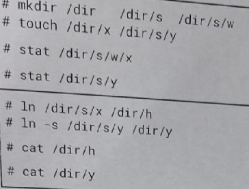

# File System

## El superbloque de un sistema de archivos indica que el (3) inodo correspondiente al directorio raiz es el \#43. En la siguiente secuencia de comandos, y siempre partiendo desde el directorio raiz, se pide indicar la cantidad d einodos y bloques de datos a los que se precisa acceder (leer) para resolver la ruta dada a cat(1) o stat(1).



> [!TIP]
> Todos los directorios ocupan un bloque. La idea es que describan como stat llega a los archivos.

Lo siguiente: 
- mkdir /dir /dir/s /dir/s/w
- touch /dir/x dir/s/y

Tiene esta estructura:

```
root
    |-> dir
        |-> x.file
        |-> s
            |-> y.file
            |-> w
```
- a) stat /dir/s/w/x
  - Inodo root (\#43) $\rightarrow$ bloque de datos con dentry ("dir", nodo)
  - inodo dir $\rightarrow$ Bloque de datos con dentry (s, inodo, x, inodo)
  - inodo s $\rightarrow$ Bloque de datos con dentry (y, inodo, w, inodo)
  - inodo w $\rightarrow$ Bloque de datos con dentry (vacio $\rightarrow$ devuelve error).

> En este caso la cantidad de inodos y bloques de datos es igual, siendo 4.

- b) stat /dir/s/y
  - Inodo root (\#43) $\rightarrow$ bloque de datos con dentry ("dir", inodo)
  - inodo dir $\rightarrow$ Bloque de datos con dentry (s, inodo, x, inodo)
  - inodo s $\rightarrow$ Bloque de datos con dentry (y, inodo, w, inodo)
  - inodo y $\rightarrow$ Contiene los atributos para stat.

> En este caso la cantidad de inodos es 4 mientras que los bloque de datos leidos son 3.

Lo siguiente:
- ln /dir/s/x /dir/
- ln -s /dir/s/y /dir/y

- cat /dir/h
- cat /dir/y

Tiene esta estructura:
```
root
    |-> dir
        |-> y.softlink
        |-> h.hardlink
        |-> s
            |-> x.file
            |-> y.file
```

>[!WARNING]
> Asumo que existe `/dir/s/x` sino da error en el primer comando. En el caso del segundo, no es tan importante que existe `dir/s/y` pero tambien asumo que existe.

- c) cat /dir/h
  - Inodo root (\#43) $\rightarrow$ bloque de datos con dentry ("dir", inodo)
  - inodo dir $\rightarrow$ Bloque de datos con dentry (s, inodo, y, inodo, h, inodo)
  - inodo h $\rightarrow$ contiene al inodo dir/s/x $\rightarrow$ bloque de datos de h o /dir/s/x.

> En este caso la cantidad de inodos es igual a la cantidad de bloques de datos leidos, siendo esta cantidad 3.

- d) cat /dir/y
  - Inodo root (\#43) $\rightarrow$ bloque de datos con dentry ("dir", inodo)
  - inodo dir $\rightarrow$ Bloque de datos con dentry (s, inodo, y, inodo, h, inodo)
  - inodo y $\rightarrow$ bloque de datos de y (contiene path a /dir/s/y).
  - inodo root (\#43) $\rightarrow$ bloque de datos con dentry ("dir", inodo)
  - inodo dir $\rightarrow$ Bloque de datos con dentry (s, inodo, y, inodo, h, inodo)
  - inodo s $\rightarrow$ Bloque de datos con dentry (x, inodo, y, inodo)
  - inodo y $\rightarrow$ Contiene los datos de y.

> En este caso la cantidad de inodos es igual a la cantidad de bloques de datos leidos, siendo esta cantidad 7.

## Describa la estructura de un inodo.

- El inodo contiene metadata y punteros (directos o indirectos) a los bloques de datos. Un posible grafico para representar un inodo es el siguiente:


Donde sus campos son:

- **Modo:** Permisos de lectura, escritura y ejecucion.
- **Nro. de links:** Número de hard links, si es cero, se elimina el archivo.
- **UID:** ID del usuario dueño.
- **GID:** ID del grupo dueño.
- **Fecha de acceso, modificacion y creacion.**
- **Punteros.**


# Scheduling, Memoria y Concurrencia

## ¿Que es un deadlock? Describa por lo menos 3 casos diferentes en el que puede suceder esta situación.

> [!NOTE]
> Resuelto en el Parcial 1.

## Cual es la cantidad de Kbytes que se pueden almacenar en un esquema de memoria virtual de 48 bits con 4 niveles de indirección, en la cual una dirección de memoria se describe como sigue: 9 bits page dir, 9 bits para cada page table y 12 bits de offset. Explicar.

- Como la memoria virtual es de 48 bits, entonces es posible tener $2^{48}$ posiciones de memoria.

- Asumiendo que cada dirección como un byte necesitaremos entonces $2^{48}$ bytes.

- Entonces, $2^{48} \text{bytes} = \frac{2^{48} \text{kilobytes}}{1024} = \frac{2^{48} \text{kilobytes}}{2^{10}}$, entonces la cantidad total de kilobytes es **$2^{38}$**.

> [!NOTE]
> Haciendo el pasaje, $2^{38}$ kilobytes es lo mismo que 256 terabytes.
