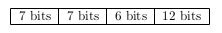
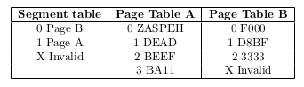

# File System
## Diseñe un vsfs para un sistema de 1024 bloques, cada bloque ocupa 4kb y cada inodo 256 bytes. Asumir que en un disco de N bloques entran N archivos.

- **Cantidad de inodos necesarios:** 1024.
- **Cantidad de inodos por bloque:** $\frac{4096}{256} = 16$ ($1024 \times 4 = 4096$).
- **Cantidad de bloques de inodos:** $\frac{1024}{16} = 64$.
- **Cantidad de bitmap:** $4096 \times 8 = 32768$. (Sobra! El disco tiene 1024 bloques y 1024 inodos)

Entonces:

- 1 Superbloque.
- 1 bloque de bitmap de inodos.
- 1 bloque de bitmap de bloques.
- 64 bloques de inodos.
- 957 bloques de datos ($1024 - 64 - 1 - 1 = 957$)

## Sea un disco que posee 512 bloques de 4kb y un sistema operativo cuyos inodos son de 256 bytes, definir un sistema de archivos FFS.

- Como $1 \text{Kb} = 1024 \text{bytes}$, el tamaño de cada bloque es de $4 \times 1024 \text{bytes} = 4096\text{bytes}$.
- Como es necesario guardar metadata, debe haber la misma cantidad de inodos que de bloques, por lo que la cantidad de inodos por bloque sabiendo que este ocupa $256 \text{bytes}$ es de: $\frac{4096 \text{bytes}}{256 \text{bytes}} = 16$.
- La cantidad de bloques de inodos debe ser de $\frac{512}{16} = 32$ ya que en cada bloque entran 16 inodos.
- Teniendo todo esto en cuenta obtenemos qué el sistema de archivos queda definido como:

1. 1 super bloque
2. 1 bloque de bitmap de inodos
3. 1 bloque de bitmap de bloques
3. 32 bloques de inodos
4. 477 bloques de datos $\rightarrow$ $477 + 1 + 1 + 1 + 32 = 512$

> [!NOTE]
> El ejercicio no lo pide, pero como se tienen 477 bloques de datos, el tamaño de archivo más grande es de $477 \times 4 \times 1024 \text{bytes} = 1953792 \text{bytes} = 1.95 \text{Mb}$

## Suponiendo que BigFS es una variante de FSS, el clasico sistema de archivos de unix, el cual posee 12 referencias inodos directas, 1 indirecta, 1 doble indirecta, una triple indirecta y una cuadruple indirecta. Asumiendo bloques de 4KB, 8 byte por puntero a bloques ¿Cuál es el máximo tamaño de archivo que se soporta? Expresar en Terabytes

- Cada referencia directa apunta a un bloque de 4kb, por lo que tenemos $12 \times 4\text{kb} = 48Kb$ siendo 12 la misma cantidad de inodos y de bloques.

- Para las referencias indirectas hay que calcular cuantas referencias entran en un bloque. Sabemos que los bloques son de 4KB y que cada referencia es de 8 bytes, por lo que (pasando todo a bytes) obtenemos qué: $\frac{4096}{8} = 512$ referencias. Cada una de estas referencias apunta a un bloque de 4Kb, por lo que se tienen $4\text{Kb} \times 512 = 2048 \text{Kb}$.

- Para un bloque doble indirecto, se tendrá un bloque con referenicas a bloques indirectos, donde esos bloques tienen las referenicias al bloque de datos. Por lo calculado en el item anterior sabemos que un bloque indirecto tiene 512 referencias, y al estar en un bloque doble indirecto este tambien tendrá otras 512, por lo qué la cantidad total de referencias será de $512 \times 512 = 512^{2}$, donde se tiene $512^{2 \times 4 \text{kb}}$ debido a que cada bloque ocupa 4kb.

- Este misma idea aplica para los bloques triple y cuadruple indirectos, obteniendo que ambos tienen $512^{3}$ y $512^{4}$ referencias respectivamente.

- Finalmente, para el cálculo final se puede decir qué es de: $(12 + 512 + 512^{2} + 512^{3} + 512^{4}) \times 4 \text{KB}$. Para expresar el resultado final en Teras hay que dividir la cuenta anterior por 1000 3 veces, obteniendo que el tamaño máximo de archivo que soporto el sistema es de aproximadamente 275 TB. 

# Memoria

## Explicar el mecanismo de address translation de memoria virtual paginada de tres niveles de indirección de 32 bits. Indique la cantidad de direcciones de memoria que provee, una virtual address: 

- Por la estructura del virtual address se puede decir qué:
  1. Los primeros 7 bits corresponden al primer nivel de página.
  2. Los siguientes 7 bits corresponden al segundo nivel de página.
  3. Los siguientes 6 bits corresponden al tercer nivel de página.
  4. Los 12 bits restantes corresponden al offset dentro de la página.

- Cada página tiene un tamaño de 4KB, ya que $2^{12} = 4096$.
- Para realizar la traducción se leen los primeros 7 bits los cuales corresponden a la primer página, luego se leen los siguientes 7 bits para recorrer la primer página, la cual puede caer en un puntero que direccióna a la siguiente página. Esto mismo aplica en la segunda página, luego finalmente se calcula el offset y se busca el dato.

## Traducir las direcciones virtuales a físicas: [00000000], [2000220002], [10222002], [00015555] suponiendo lo siguiente:

- 4 bit para el segment number.
- 12 bit para el page number.
- 16 bit para el offset.

Las direcciones de memoria estan en hexadecimal, por lo que:
- El primer dígito representa el Segment table.
- Los siguientes 3 dígitos representan el Page table.
- El resto de los dígitos representan el offset.

Entonces:

- 00000000 $\rightarrow$ Mapea a la Página B, donde el page table es F00, entonces la dirección física es F00 + 0000 = F0000000.
- 20022002 $\rightarrow$ Como el primer dígito no mapea a ninguna página del segment table, la dirección es invalida.
- 10022002 $\rightarrow$ Mapea a la Página A, donde el page table es BEEF, entonces la dirección física es BEEF + 2202 = BEEF2202.
- 00015555 $\rightarrow$ Mapea a la Página B, donde el page table es D8BF, entonces la dirección física es D8BF + 5555 = D8BF5555.

## Considere un sistema x86 de memoria virtual paginada de dos niveles con un espacio de direcciones de 32 bits, donde cada pagina tiene un tamaño de 4096 bytes. Un entero ocupa 4 bytes y se tiene un array de 50,000 enteros que comienza en la dirección virtual 0x01FBD000. Si el arreglo se recorre completamente accediendo a cada elemento una vez ¿A cuantas páginas distintas necesita acceder el sistema operativo para conseguir esto?

- Como la arquitectura es x86 las direcciones de 32 bits estan compuesta por:
  1. 10 bits de page directory.
  2. 10 bits de page number.
  3. 12 bits de offset.

- Como las direcciones virutales son de 32 bits, cada entero ocupa una dirección de memoria de 4 bytes, entonces el tamaño total del arreglo es de $50,000 \times 4 = 200,000$ bytes.
- Como el arreglo empieza en la dirección virtual 0x01FBD000 debo desplazarme 50.000 posiciones para llegar al final. El calculo de la dirección final es de $0x01FBD000 + 50,000 \times 4 = 0x01FBD000 + 200,000 = 0x01FBD000 + 0x00030D40 = 0x01FE0D40$.

- Pasando las direcciónes virtuales de hexadecimal a binario obtengo qué:
  1. 0x01FBD000 = 0000 0001 1111 1011 1101 0000 0000 0000.
  2. 0x01FE0D40 = 0000 0001 1111 1110 0000 1101 0100 0000.

- Donde el page dir es: 0000 0001 11 y el page number es: 11 1011 1101 para la primer dirección.
- Donde el page dir es: 0000 0001 11 y el page number es: 11 1110 0000 para la segunda dirección.

- Se puede observar como el page dir es el mismo, mientras que los page number en base 10 son 957 y 992 respectivamente. Por lo que el sistema operativo necesita acceder a 37 páginas distintas.

## Dado un espacio de direcciones virtuales con direcciones de 8 bits y páginas de 16 bytes, asume un array de 12 enteros (cada uno de 4 bytes) comenzando en la dirección virtual 100. Calcula el patrón de aciertos y fallos en la TLB cuando se accede a todos los elementos del array en un bucle. Asume que inicialmente, la TLB está vacı́a.

- La dirección virtual inicial es 100, mientras que la final es 100 + 12 * 4 = 148.
- Pasando las direcciones virtuales a binario obtengo qué son las siguientes 100 = 0110 0100 y 148 = 1001 0100.
- Cómo los primeros 4 bits representan el page number ($2^{\text{offset}} = 16 \rightarrow \text{offset} = 4$) puedo decir que la primer página accedida es la 0110 y la última es la 1001. Pasando estos números de binario a decimal obtengo que son 6 y 9 respectivamente.
- Finalmente, el arreglo de enteros accede a las páginas 6, 7, 8 y 9. Por lo que el patrón de aciertos y fallos en la TLB es el siguiente:
1. 4 Fallos ya que cada uno corresponde a la primera vez que se accede a una de las páginas.
2. 8 aciertos que corresponde a la diferencia entre la cantidad de accesos totales y los fallos, es decir, $12 - 4 = 8$.
