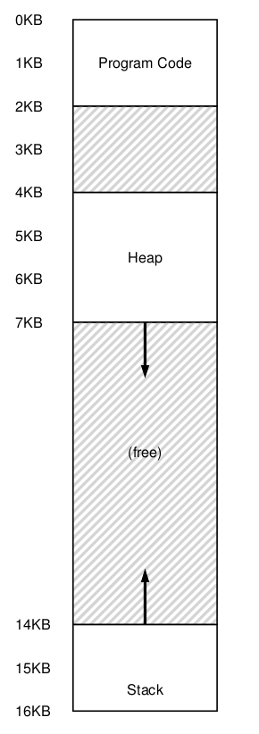
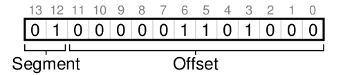
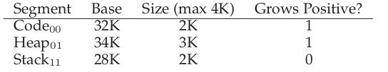
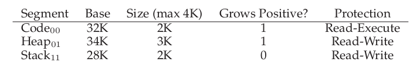

# Segementation

> Si bien el approach de **base and bounds** es útil, se puede ver como entre medio de los address spaces hay una gran parte de memoria libre. Si bien esta memoria no está siendo usada por el proceso en sí, esta ocupando **memoria física** cuando se podría realocar todo el address space de un proceso a un lugar contiguo en memoria física.

- En la imágen se puede ver como tenemos 3 segmentos lógicos $\rightarrow$ Stack, Heap y el código.

- Teniendo eso en cuenta, lo que la **segmentación** permite es alocar estos segmentos en distintos lugares de la memoria física, utilizando 3 pares de registros para hacer **base and bounds**.

- Entonces, en este caso, para poder soportar la segmentación, el MMU debe proveer de 3 pares de registros base y bound.

## Calculo de offset y referencia de segmentos

### Explicito

- Para calcular el offset se pueden utilizar 2 bits para el segmento (0 y 1) los cuales indican a que segmento se esta referenciando y luego los siguientes 12 bits el offset a calcular.

En este caso los primeros 2 bits le dicen al hardware que segmento se esta referenciando y luego los siguientes 12 bits son el offset (en este caso 0000 0110 1000).

### Implicito

En este caso el hardware determina que segmento es fue formada la dirección de memoria. Ejemplos:

- Si el address fue generado por el program counter (por ejemplo fue un fetch) $\rightarrow$ el address esta en el code segment.

- Si el address esta basado en el stack pointer $\rightarrow$ el address esta en el stack segment.

- En cualquier otro caso $\rightarrow$ el address esta en el heap segment.

## Stack

> El stack **crece hacia atras**, es decir, si empeiza en 28KB, crecerá hasta 26KB, y así sucesivamente. Esto significa que la traducción de direcciones debe ser realizada de forma distinta.

- Para esto se necesita ayuda del hardware, se agrega un bit de dirección de crecimiento $\rightarrow$ Si crece hacia los positivos el bit estará prendido (en 1), de lo contrario estará apagado (en 0).

- Con esto, cambia un poco la forma de calcular el offset. Se resta el offset con el máximo valor que un segmento puede tomar, por ejemplo 4kb. Si ocurre que el offset para calcular es menor que el tamaño del segmento, el offset será negativo llegando así a la dirección correcta en el sentido de los negativos.

## Soporte para compartir

> Con un poco más de ayuda del hardware se pudo optmizar la memoria. En particular, compartiendo ciertos segmentos entre address spaces.

- Con la ayuda de **protection bits** se indica si un programa o no puede leer o escribir un segmento, ejecutar código, etc. 

- Con esto, además de chequear todo lo demás, tambien se deben chequear los bits de protección.

## Fine-grained vs Coarse-grained Segmentation

> Mientras que **coarse-grained** separá en address spaces relativamente más grandes, como en los ejemplos anteriores donde había pocos segmentos, **fine-grained** busca separar en segmentos más pequeños pero en mayor cantidad, brindando así mayor flexibilidad.

