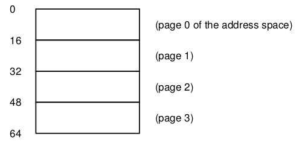
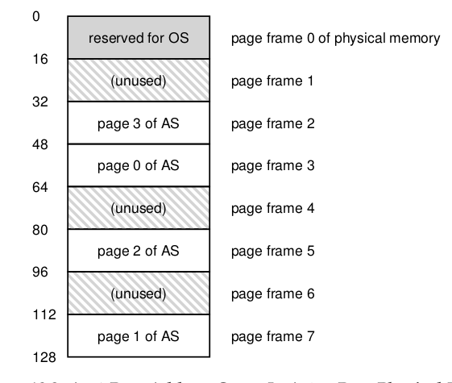

# Paging: Introduction

- En la **segmentación** hay un problema inevitable $\rightarrow$ **fragmentación** de la memoria. Si bien se puede resolver utilizando **compactación**, esta tarea es muy costosa, lo cual la hace ineficiente.

- Dentro de la memoria virtual, llamamos **paginiación** (paging) al *partir* el espacio en partes de tamaños pre-fijados 

- En vez de separar el address space de un proceso en segmentos lógicos de tamaño variable, lo dividimos en unidades de tamaño fijo $\rightarrow$ páginas.

- Con esto, se puede tratar a la memoria física como un array con espacios de tamaño fijo llamados **page frames**, donde cada uno puede contener una única página virtual.

- La ventaja de la paginación es que es mucho mas flexible, y con ella es posible implementar un sistema de memoria virtual sin fragmentación interna. A su vez, permite crear la abstracción completa de un address space, sin tener en cuenta (por ejemplo) en que dirección crece el heap/stack o como utiliza el proceso el address space.

- **Page Table:** Es una estructura de datos que mapea las páginas virtuales a las páginas físicas. Cada proceso tiene su propia page table, que se almacena en memoria y es accedida por el hardware. Su mayor rol es almacenar las traducciones de los address para cada página virtual del address space.
