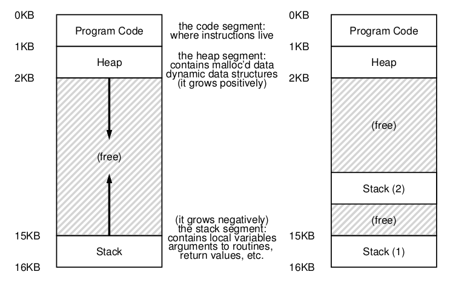

# Concurrency: An Introduction

- **Thread:** Abstracción para un solo proceso en ejecución. Se puede pensar a un thread como un proceso, con la salvedad de que comparten el mismo address space y, por ende, pueden acceder a la misma data.

- El uso de threads surge para poder **paralelizar** tareas, de esta forma se obtiene una mejor performance.

- Otra razon, pero más sútil es para tratar las operaciones bloqueantes I/O.

- Al crear threads, su salida no es determinística, ya que quien decide que se ejecutará primero es el **scheduler**.

> [!NOTE]
> Como cada thread tiene virtualizado sus registros, si por ejemplo corremos un programa con 2 threads para incrementar una variable global muy grande, lo que puede pasar es que algunas acciones no terminen de ejecutarse (ej timer interrupt), y por ende, la variable global no terminará en el valor esperado.

- **Race condition:** Ocurre cuando dos o más threads intentan modificar una variable compartida al mismo tiempo. Para evitar esto, se puede usar un **mutex**.

Esto ocurre por la falta de `atomicidad`, no hay garantía de que el procesador pueda ejecutar todas las intrucciones en un único ciclo de instrucción.

